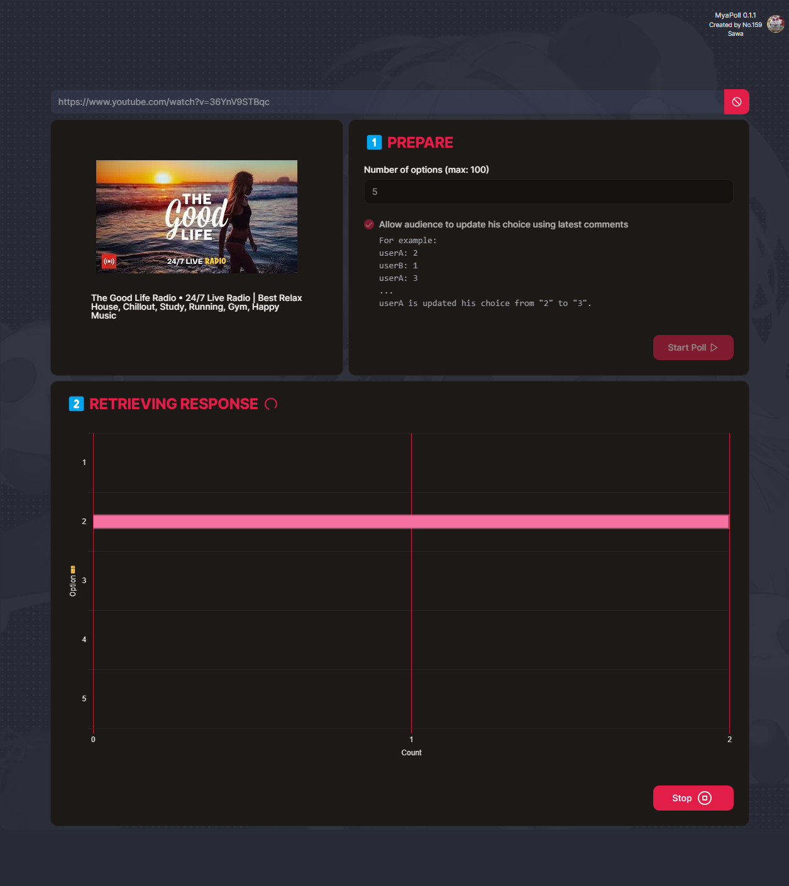

# MyaPoll


## Introduction



A polling application designed specifically for YouTube livestream, enabling the collection of real-time audience comments as poll responses.

## Usage

1. Launch the web application and start a poll event within the YouTube livestream.
2. Enter the passphrase for authentication purposes.
3. Provide the URL of the live stream, such as <https://www.youtube.com/watch?v=92VgDXjI4Xg>
4. Specify the number of options. By default, the application allows the audience to update their choices using the latest comments, but you also have the option to disable this feature.
5. Click on the 'Start Poll' button to commence the collection of poll responses. A chart will update in realtime to represent to poll response data.
6. Press the 'Stop' button to manually end the poll.
7. The poll result summary will be displayed.
8. Click on 'Next Poll' to initiate another new poll event.

### Notices

🗝️ Secret Code Protection: only designated individuals can use this application.  
✨ This webapp consume Youtube Data API v3, which has daily quota limit (free).

## Development

### Setup env var

create `.env.local` in project root directory, fill in your youtube API token and myaPoll app passphrase.

```txt
YT_DATA_API_TOKEN=
YT_DATA_API_TOKEN_DEV=
PASSPHRASE=
PASSPHRASE_DEV=
```

### Start development server

```bash
npm run dev
# or
yarn dev
# or
pnpm dev
```

Open [http://localhost:3000](http://localhost:3000) with your browser to see the result.

## Deploy on Vercel

```txt
🚨 Remember to add env var above to Vercel.
```

The easiest way to deploy your Next.js app is to use the [Vercel Platform](https://vercel.com/new?utm_medium=default-template&filter=next.js&utm_source=create-next-app&utm_campaign=create-next-app-readme) from the creators of Next.js.

Check out our [Next.js deployment documentation](https://nextjs.org/docs/deployment) for more details.
